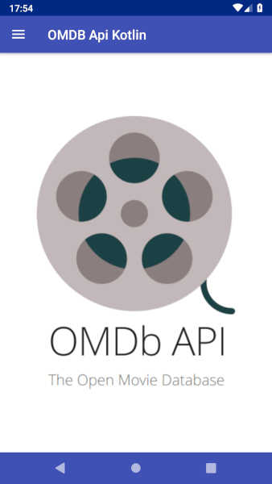
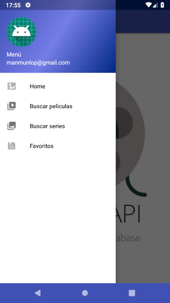
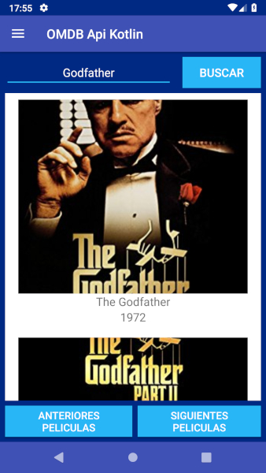
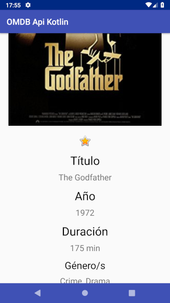

# **Kotlin OMDB Api**

Aplicación realizada en Kotlin, la aplicación permite buscar películas o series mediante la api [OMDB](http://www.omdbapi.com/) 

Para que funcione es necesario adjuntar una Api Key en el fichero **build.gradle**

La apliación utiliza el formato 'Navigation Drawer' por el cual crea un menú hamburguesa con distintas secciones

## **Sección Peliculas**

La sección permite buscar películas en base aún texto, si el resultado es correcto mostrará un listado de 10 elementos y es posible avanzar o retroceder en ese listado con los botones inferiores. Si la búsqueda no contiene resultados no se mostrará nada en la apliación.

Al pulsar en la imagen se cargará un activity nuevo que contendrá información detallada en base a ese resultado.

Al pulsar sobre el icono de la estrella se guardará o quitará el elemento en la base de datos externa del IES Ayala.

## **Sección Series**

La sección permite buscar series en base aún texto, si el resultado es correcto mostrará un listado de 10 elementos y es posible avanzar o retroceder en ese listado con los botones inferiores. Si la búsqueda no contiene resultados no se mostrará nada en la apliación.

Al pulsar en la imagen se cargará un activity nuevo que contendrá información detallada en base a ese resultado.

Al pulsar sobre el icono de la estrella se guardará o quitará el elemento en la base de datos externa del IES Ayala.

## **Sección Favoritos**

La sección muestra un listado de favoritos, ya sean películas o series.

Al pulsar en la imagen se cargará un activity nuevo que contendrá información detallada en base a ese resultado.

Al pulsar sobre el icono de la estrella se guardará o quitará el elemento en la base de datos externa del IES Ayala.

# **Screenshots**

